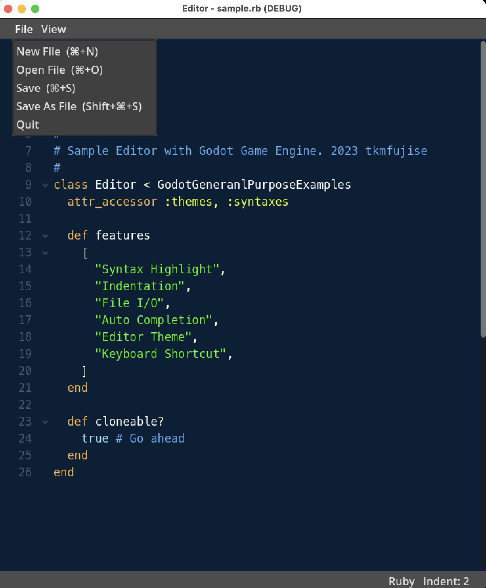

# Editor



## Features
* Syntax Highlight
* Indentation
* File I/O
* Auto Completion
* Editor Theme
* Keyboard Shortcut


## 解説

https://zenn.dev/tkmfujise/articles/5651b342278e59


## Structure

**Files**
```
Editor
├── CodeArea.gd
├── FileMenu.gd
├── Main.gd
├── Main.tscn
├── code_syntaxes
│   ├── HTML-syntax.tres
│   ├── Markdown-syntax.tres
│   └── Ruby-syntax.tres
├── code_themes
│   ├── Gessetti-theme.tres
│   └── Pennarelli-theme.tres
├── fonts
│   └── Menlo-Regular.ttf
├── project.godot
└── resource_definitions
    ├── SyntaxResource.gd
    └── ThemeResource.gd
```

**Classes**


## Syntax Highlight

**code_syntaxes/Ruby-syntax.tres (SyntaxResource)**
```
[resource]
indent_size = 2
regions = {
  # "key": [["begin_str", "end_str"]]
  "comment": [["#", ""]],
  "constant": [[":", " "]],
  "string": [["'", "'"], ["\"", "\""]]
}
keywords = {
  # "key": ["word"]
  "boolean": ["true", "false", "nil"],
  "keyword": [
    "class", "def", "end", "module", "require", "return",
    "initialize", "attr_accessor"
  ]
}
completions = [
  ["class", "class"], ["def", "def"], ["end", "end"], 
  ["return", "return"], ["module", "module"], 
  ["require", "require"], ["attr_accessor", "attr_accessor"]
]
```

**code_themes/Gessetti-theme.tres (ThemeResource)**
```
[resource]
syntax_colors = {
  # "key": ["color"]
  "boolean": "#98E1FF",
  "comment": "#5DA9EC",
  "constant": "#DCF710",
  "keyword": "#F4B043",
  "string": "#46F009"
}
```

**Main.gd**
```
const EXTENSIONS = {
    # "SyntaxName": ["extension"]
    "Ruby": ["rb", "erb", "ruby"],
    "HTML": ["html", "htm"],
    "Markdown": ["md", "markdown"],
}
const THEMES = ["Gessetti", "Pennarelli"]
```