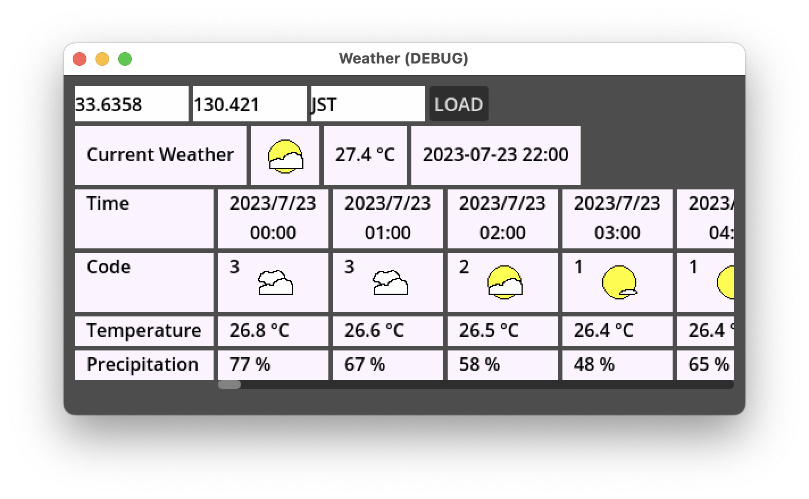

# Weather




## Structure

**Files**
```
Weather
├── HourlyTable.gd
├── HourlyTable.tscn
├── Main.gd
├── Main.tscn
├── Theme.tres
├── WeatherAPI.gd
├── WeatherIcon.gd
├── WeatherIcon.tscn
├── assets
│   ├── icons
│   │   ├── 0_clear_sky.png
│   │   ├── 1_mainly_clear.png
│   │   ├── 2_partly_cloudy.png
│   │   ├── 3_overcast.png
│   │   ├── 45_fog.png
│   │   ├── 51_drizzle_light.png
│   │   ├── 80_rain_showers_slight.png
│   │   ├── 95_thunderstorm_slight.png
│   │   ├── 96_thunderstorm_with_slight.png
│   │   └── unknown.png
│   └── spinner.png
└── project.godot
```

**Classes**


